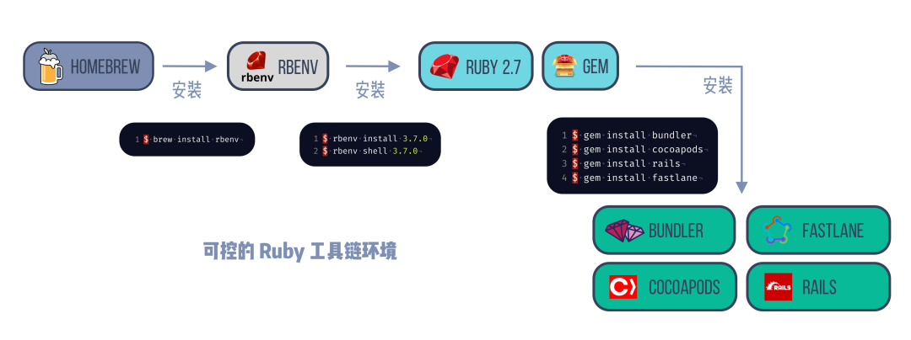

# SIL(Swift Intermediate Language )

由于swift编译器是基于LLVM实现，所以我们先了解一下LLVM。

## LLVM

LLVM是一套用来开发编译器的架构。

LLVM编译架构的三段式设计（前端、中间优化器、后端）：



* 前端：**解析源代码**。通过词法分析、语法分析、语义分析，检查代码中是否存在错误，然后构建**抽象语法树**（Abstract Syntax Tree ， **AST**），然后生成**中间代码（** Intermediate Representation，**IR**，IR的表现形式有三种：text、memory、bitcode**）。**
* 中间优化器：负责各种优化，**缩小包的体积**（剥离符号 **）** 、**改善代码的运行时间（** 消除冗余计算、减少指针跳转次数等）。
* 后端：代码生成器。将IR映射到目标指令集，生成**机器语言**，并且进行机器相关的代码优化。

LLVM使用的是统一的中间代码IR，如果需要支持一种新的语言，只要实现一个新的前端；如果要支持一种新的设备，只要实现一个新的后端。

LLVM把编译器的前端和后端解耦，使得他的可扩展性非常强。

也让LLVM成为了实现编程语言时的通用基础架构：包括GCC家族、Java、.NET、Python、Ruby、Scheme、Haskell、D等。

## Clang

Clang是基于LLVM架构的C/C++/Objective-C编程语言的编译器前端。

.png>)

.png>)

可以看到Clang编译过程中有些问题：

* 源代码和 LLVM IR 之间有一个巨大的抽象层，但是这个抽象层在 clang 里面实现的并不完美：
  * 语法分析和语义分析之间很乱
  * AST‘ 转换成 IR 的过程也是相当的曲折
* 由于不同的编程语言生成的统一的IR，导致IR 不合适源码级别分析
* clang 的静态分析实现（CFG，Control Flow Graph）不够精确，和 IR 之间有很多重复的逻辑。


## swift编译器

.png>)

.png>)

与clang相比，swift的前端编译流程中，在AST和IR中间多了一层SIL，以弥补clang的缺陷，原本在 clang 中独立的静态分析和 IR 生成阶段整合了起来**。**

可以看到Clang在实现的时候，很多阶段交织在一起，耦合严重，而swift加入了sil中间层，解决了这个问题。

## sil

### 特点

*   Fully represents program semantics&#x20;

    能够完整的表达程序的语义。
*   Designed for both code generation and analysis&#x20;

    被设计用于代码生成和静态分析
*   Sits on the hot path of the compiler pipeline&#x20;

    处于编译的流水线中，而不是独立于之外
*   Bridges the abstraction gap between source and LLVM

    在源代码和 LLVM 之间架起了抽象的桥梁

### 语法

[官方文档](https://github.com/apple/swift/blob/main/docs/SIL.rst)

* `%0`、`%1` 等：寄存器，相当于块中的局部变量
* `bb0`、`bb1` 等：代码块，由指令组成，结束时从函数返回或者跳转其他代码块
* `$String`：String 类型
* `$*String`：String 类型的值地址
* `sil_global`：全局变量
* `apply`：调用函数，并传入参数
* `function_ref`：直接函数调用
* `class_method`：通过函数表来查找实现调用
* `sil_vtable`：类的函数表
* `thin`：静态的
* `thick`：动态的，运行时的
* `cond_br`：类似于三目运算符，判断寄存器上值进行代码块跳转

### 作用

* 看编译器不同级别的优化（比如无用代码裁剪，不同写法对性能影响）
* 了解函数派发方式（`final`/`static`/`dynamic` 等）对函数的影响，KVO
* 了解swift语言的底层实现
* 等等

### Builtin <a href="#builtin" id="builtin"></a>

Builtin 将 LLVM IR 的类型和方法直接暴露给 Swift 标准库，使用时没有额外的运行时负担。

#### 源码生成sil文件的命令：

```bash
// 将 main.swift 编译成 SIL 代码
swiftc -emit-sil main.swift 

// 将 main.swift 编译成 SIL，并保存到 main.sil 文件中
swiftc -emit-sil main.swift >> main.sil

// 将 main.swift 编译成 SIL的同时， 将命名重整后的符号恢复原样，并保存到 main.sil 文件中
swiftc -emit-sil main.swift | xcrun swift-demangle >> main.sil
```

## 通过sil理解swift的底层实现

### 空文件生成的sil：


```
```



```
sil_stage canonical

import Builtin
import Swift
import SwiftShims

// main
sil @main : $@convention(c) (Int32, UnsafeMutablePointer<Optional<UnsafeMutablePointer<Int8>>>) -> Int32 {
bb0(%0 : $Int32, %1 : $UnsafeMutablePointer<Optional<UnsafeMutablePointer<Int8>>>):
  %2 = integer_literal $Builtin.Int32, 0          // user: %3
  %3 = struct $Int32 (%2 : $Builtin.Int32)        // user: %4
  return %3 : $Int32                              // id: %4
} // end sil function 'main'


// Mappings from '#fileID' to '#filePath':
//   'Model/Model.swift' => 'Model.swift'
```


* sil文件对第一行表示sil阶段是canonical。sil有两个阶段：raw和canonical
  * raw是第一个阶段，对AST进行基础的担保优化和语法诊断，生成原始的sil
  * canonical是第二阶段，进行特定优化，生成正式的sil
  * 之后的编译会由IRGen把sil生成IR，然后经过编译器后端，生成Mach-O文件
* 接下来是头部声明。sil文件中没有隐式import，如果使用swift或者[Buildin](http://ankit.im/swift/2016/01/12/swift-mysterious-builtin-module/)标准组件的话必须明确的引入。
* 接着是sil的main函数（程序入口）。
  * `@main` 表示方法的名字是main，SIL中所有标识符均以@符号开头。
  * `@convention(c)` 表示使用C函数的方式进行调用
  * `bb0`=basic block zero，表示一个代码块，SIL中没有分支语句，只有入口和出口；
    * `%0`：传入basic block的第一个参数是int32类型，%符号表示一个虚拟寄存器，后续进行降级操作时，才会把虚拟寄存器转换成对应体系结构的真实寄存器。
    * `%1`：第二个参数。
    * `%2`：创建一个类型为Builtin.Int32的值，赋值给%2
      * `// user: %3`：表示赋值语句的结果，会被 id 是 3 的表达式用到。
      * 赋值语句都会注释使用者是谁。
    * %3：创建一个类型为Int32的值，赋值给%3
    * return：返回%3，类型位Int32
      * `// id: %4`：表示该语句对id为4
      * 非赋值语句都会标注 id 是什么。

### 存储属性&计算属性


```
let a: Int = 1
var b: Int {
    return a
}
```



```
@_hasStorage @_hasInitialValue let a: Int { get }

var b: Int { get }

// a
sil_global hidden [let] @Model.a : Swift.Int : $Int

// main
sil @main : $@convention(c) (Int32, UnsafeMutablePointer<Optional<UnsafeMutablePointer<Int8>>>) -> Int32 {
bb0(%0 : $Int32, %1 : $UnsafeMutablePointer<Optional<UnsafeMutablePointer<Int8>>>):
  alloc_global @Model.a : Swift.Int                    // id: %2
  %3 = global_addr @Model.a : Swift.Int : $*Int        // user: %6
  %4 = integer_literal $Builtin.Int64, 1          // user: %5
  %5 = struct $Int (%4 : $Builtin.Int64)          // user: %6
  store %5 to %3 : $*Int                          // id: %6
  %7 = integer_literal $Builtin.Int32, 0          // user: %8
  %8 = struct $Int32 (%7 : $Builtin.Int32)        // user: %9
  return %8 : $Int32                              // id: %9
} // end sil function 'main'

// b.getter
sil hidden @Model.b.getter : Swift.Int : $@convention(thin) () -> Int {
bb0:
  %0 = global_addr @Model.a : Swift.Int : $*Int        // user: %1
  %1 = load %0 : $*Int                            // user: %2
  return %1 : $Int                                // id: %2
} // end sil function 'Model.b.getter : Swift.Int'
```



### swift中的两种函数派发方式

swift中有两种函数派发方式：函数表派发（动态派发）和直接派发（静态派发）。

我们知道静态派发要比动态派发效率高。

那么怎么把动态派发消解为静态派发呢？

* struct默认使用静态派发，class默认动态派发。
* 对于class：
  * final会约束类无法被继承，动态派发会转为静态派发
  * private会约束方法或属性无法被外部访问，动态派发会转为静态派发

> swift比OC快的一个关键就是可以消解动态派发。

#### 函数表派发


```
class Point {
    public func one() -> Int { return 1 }
}

let a = Point().one()
```



```
// main
sil @main : $@convention(c) (Int32, UnsafeMutablePointer<Optional<UnsafeMutablePointer<Int8>>>) -> Int32 {
bb0(%0 : $Int32, %1 : $UnsafeMutablePointer<Optional<UnsafeMutablePointer<Int8>>>):
  alloc_global @Model.a : Swift.Int                    // id: %2
  %3 = global_addr @Model.a : Swift.Int : $*Int        // user: %10
  %4 = metatype $@thick Point.Type                // user: %6
  // function_ref Point.__allocating_init()
  %5 = function_ref @Model.Point.__allocating_init() -> Model.Point : $@convention(method) (@thick Point.Type) -> @owned Point // user: %6
  %6 = apply %5(%4) : $@convention(method) (@thick Point.Type) -> @owned Point // users: %9, %8, %7
  %7 = class_method %6 : $Point, #Point.one : (Point) -> () -> Int, $@convention(method) (@guaranteed Point) -> Int // user: %8
  %8 = apply %7(%6) : $@convention(method) (@guaranteed Point) -> Int // user: %10
  strong_release %6 : $Point                      // id: %9
  store %8 to %3 : $*Int                          // id: %10
  %11 = integer_literal $Builtin.Int32, 0         // user: %12
  %12 = struct $Int32 (%11 : $Builtin.Int32)      // user: %13
  return %12 : $Int32                             // id: %13
} // end sil function 'main'
```


#### 直接派发


```
final class Point {
    public func one() -> Int { return 1 }
}

let a = Point().one()
```



```
// main
sil @main : $@convention(c) (Int32, UnsafeMutablePointer<Optional<UnsafeMutablePointer<Int8>>>) -> Int32 {
bb0(%0 : $Int32, %1 : $UnsafeMutablePointer<Optional<UnsafeMutablePointer<Int8>>>):
  alloc_global @Model.a : Swift.Int                    // id: %2
  %3 = global_addr @Model.a : Swift.Int : $*Int        // user: %10
  %4 = metatype $@thick Point.Type                // user: %6
  // function_ref Point.__allocating_init()
  %5 = function_ref @Model.Point.__allocating_init() -> Model.Point : $@convention(method) (@thick Point.Type) -> @owned Point // user: %6
  %6 = apply %5(%4) : $@convention(method) (@thick Point.Type) -> @owned Point // users: %9, %8
  // function_ref Point.one()
  %7 = function_ref @Model.Point.one() -> Swift.Int : $@convention(method) (@guaranteed Point) -> Int // user: %8
  %8 = apply %7(%6) : $@convention(method) (@guaranteed Point) -> Int // user: %10
  strong_release %6 : $Point                      // id: %9
  store %8 to %3 : $*Int                          // id: %10
  %11 = integer_literal $Builtin.Int32, 0         // user: %12
  %12 = struct $Int32 (%11 : $Builtin.Int32)      // user: %13
  return %12 : $Int32                             // id: %13
} // end sil function 'main'
```


### V-Table & Witness-Table


```
```



```
```



