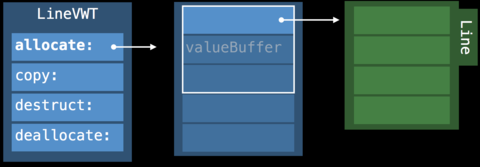
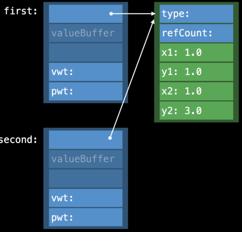
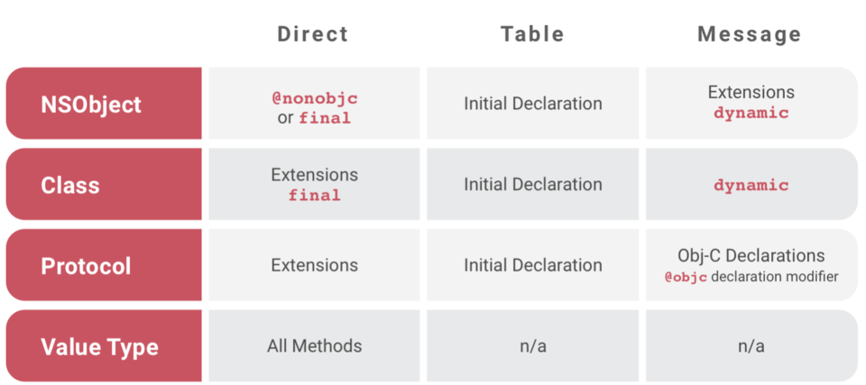

# swift性能优化

> [【基本功】深入剖析 Swift 性能优化](https://tech.meituan.com/2018/11/01/swift-compile-performance-optimization.html)
>
> 影响程序的性能标准有三种：初始化方式、引用计数、方法派发。

## 初始化方式（内存的分配）

### 栈

* 基本数据结构和struct默认存储在栈内
* 栈的内存是连续的，通过出栈入栈来分配销毁内存，效率比堆快
* 每个线程有个单独的栈空间，不存在线程安全问题

### 堆

* 高级的数据结构分配在堆（例如class）
* 初始化时查询空闲内存链找到内存，销毁时从内存中消除
* 堆区可能存在多线程访问，需要加锁操作，消耗性能
* ⚠️：堆内存除了存储需要的数据字段，还需要两个字段存储type和refCount


> 由于栈效率更高，因此有时编译器可能会提升引用类型也存储在栈上，这个过程实际发生在 SIL 优化阶段，官方术语叫做Memory promotion：SIL 阶段会尽量进行内存提升，将原来堆内存提升为栈内存，栈内存提升为 SSA 寄存器内存。

## 引用计数

* 管理引用计数，也需要消耗性能
* struct是值类型，不存在引用计数；class需要管理引用计数
* 当struct的变量中存在class类型时，对struct拷贝会导致class类型变量的引用计数增加；
* calssA的变量中有classB，对A拷贝不会导致B的引用计数增加，只会导致A的引用计数增加

## 方法派发（[**Swift 派发机制**](https://mp.weixin.qq.com/s?\_\_biz=MzU4NjQ5NDYxNg==\&mid=2247483768\&idx=1\&sn=0a6be7a9c5a374cbc5c5ba9a3c48020a\&scene=21#wechat\_redirect)**）**

### swift的派发方式

swift有两种派发方式：直接派发、函数表派发；OC还有消息派发。其中直接派发是静态派发，函数表和消息派发是动态派发。


#### 直接派发：

* 也叫静态派发，在编译期间即可确定需要执行的方法
* 可以使用内联等进一步的优化，减少函数指针的栈调用，速度更快、性能更高

#### 函数表派发：

* 每个类维护一个函数表，存储函数指针，在调用函数时，根据函数表地址和函数的偏移量找到对应的函数指针，通过指针跳转到函数的实现

#### 消息派发：

* 方法的调用包装成消息，发给_runtime_，_runtime_通过类对象或者父类找到对应的实现，找不到则抛出异常

__

#### _class_由于多态，默认使用使用函数表（_V-Table_）派发；_struct_默认使用直接派发

* 优化方式：
  * 使用_**final class**_约束类无法被继承，编译器即可转成直接派发
  * 使用_**private**_约束属性和方法（对于没有使用_final_约束的类，编译器可以通过whole module optimization检查继承关系，如果在编译期间能确定执行的方法，则会转成直接派发）
* Swift快于OC的一个关键是可以消解动态分派

### _struct_的多态_—_**动态多态**：协议（_Protocol type_）

> 协议通过Existential Container内存布局方式，实现一致性存储

#### Existential Container：

* 一种特殊的内存布局方式，使用数组存储数据，用于管理遵循了相同协议的数据类型
* 结构如下：
  * 三个词大小的ValueBuffer，每个词8字节。对于小于valueBuffer的值，valueBuffer直接寸值；若值大于valueBuffer，则存指针。
  * value witness table（vwt）：管理数据类型的生命周期
  * protocol witness table（pwt）：管理数据类型的方法派发
* [Vtable和witness table实现](https://www.jianshu.com/p/c93d7a7d6771)\
  .png>)
*   protocol type的存储

    小数（空间小于valueBuffer）通过Existential Container内联实现，大数存在堆。
*   protocol type的copy

    Indirect Storage With Copy-On-Write：拷贝时会创建新的Exsitential Container，但是vauleBuffer指向原数据相同的地址，当有写操作时才会创建新的valueBuffer


### _struct_的多态_—_**静态多态**：泛型

*
  * 静态多态：在调用栈中只有一种类型
  * 类型降级取代：swift使用只有一种类型来代替泛型
  * 每个调用上下文只有一种类型
  * 调用链中会通过类型降级进行类型取代
  * 同一类型的任一实例，使用同一个protocol witness table
  * 泛型比协议更快的原因：**特定泛型**优化（specialization）
  *
    * swift在确定入参类型时，可以通过泛型特化进行类型取代
  * 泛型的进一步优化：将泛型的内存分配由指针指定，变为内存内联，不再有额外的堆初始化消耗。
  *
    * **此种优化只适用于在运行时不会修改的泛型类型**

### 方法派发隐藏的问题



| <p><br></p>    | 直接派发                                                                   | 函数表派发       | 消息派发                           |
| -------------- | ---------------------------------------------------------------------- | ----------- | ------------------------------ |
| **NSObject**   | @nonobjc 或者 final 修饰的方法                                                | 声明作用域中方法    | 扩展方法及被 dynamic 修饰的方法           |
| **Class**      | 不被 @objc 修饰的扩展方法及被 final 修饰的方法                                         | 声明作用域中方法    | dynamic 修饰的方法或者被 @objc 修饰的扩展方法 |
| **Protocol**   | 扩展方法                                                                   | 声明作用域中方法    | @objc 修饰的方法或者被 objc 修饰的协议中所有方法 |
| **Value Type** | 所有方法                                                                   | 无           | 无                              |
| 其他             | 全局方法，staic 修饰的方法；使用 final 声明的类里面的所有方法；使用 private 声明的方法和属性会隐式 final 声明； | <p><br></p> | <p><br></p>                    |


#### [**SR-584**](https://bugs.swift.org/browse/SR-584)：在子类的extension中重载父类方法时，出现和预期不同的行为。

* 原因：NSObject的extension是使用的Message dispatch，而Initial Declaration使用的是Table dispath。extension重载的方法添加在了Message dispatch内，没有修改虚函数表，虚函数表内还是父类的方法，故会执行父类方法。
* 想在extension重载方法，需要标明dynamic来使用Message dispatch。

```swift
class Base:NSObject {
    var directProperty:String { return "This is Base" }
    var indirectProperty:String { return directProperty }
}

class Sub:Base { }

extension Sub {
    override var directProperty:String { return "This is Sub" }
}

Base().directProperty // “This is Base”
Sub().directProperty // “This is Sub”
Base().indirectProperty // “This is Base”
Sub().indirectProperty // expected "this is Sub"，but is “This is Base” <- Unexpected!
```

#### [**SR-103**](https://bugs.swift.org/browse/SR-103)：协议的扩展内实现的方法，无法被遵守类的子类重载：

* 在子类LoudPerson中没有出现override关键字。LoudPerson并没有成功注册Greetable在Witness table的方法。所以对于声明为Person实际为LoudPerson的实例，会在编译器通过Person去查找，Person没有实现协议方法，则不产生Witness table，sayHi方法是直接调用的。
* 解决办法是在base类内实现协议方法，无需实现也要提供默认方法。或者将基类标记为final来避免继承。

```swift
protocol Greetable {
    func sayHi()
}
extension Greetable {
    func sayHi() {
        print("Hello"）
    }
}
func greetings(greeter：Greetable) {
    greeter.sayHi()
}

class Person:Greetable {
}
class LoudPerson:Person {
    func sayHi() {
        print("sub")
    }
}

var sub:LoudPerson = LoudPerson()
sub.sayHi()  //sub

var sub:Person = LoudPerson()
sub.sayHi()  //HellO  <-使用了protocol的默认实现
```
